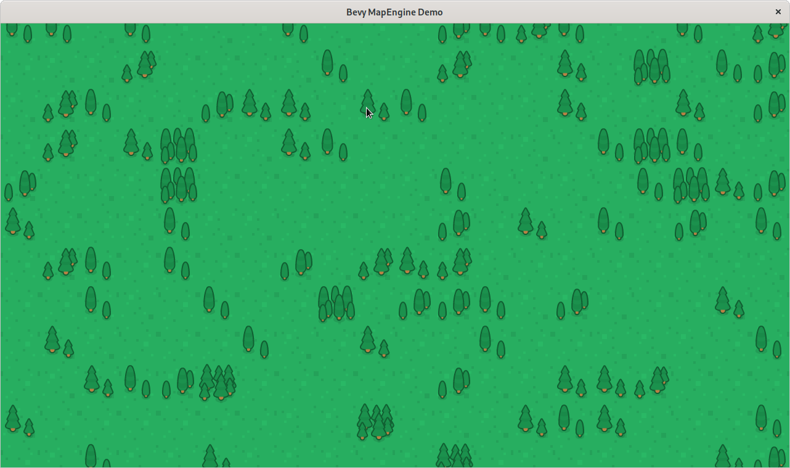

bevy_mapengine
==============

A 2D tilemap plugin for the Bevy game engine.

Update (September 2023)
-----------------------

**This is obsolete.** I was trying to do things which at the time Bevy
was not quite ready for. And, as things often go, I got distracted with
other things. Meanwhile, Bevy now has the underlying features to make
this kind of thing work better, and you probably want to use
[bevy_ecs_tilemap](https://github.com/StarArawn/bevy_ecs_tilemap). You
may also be interested in
[bevy_fast_tilemap](https://github.com/droggelbecher/bevy-fast-tilemap),
but as of this writing, that is only tested on Windows — it seems to 
work on X11 on Fedora Linux, but crashes using native Wayland.

Screenshot
----------

What is this?
-------------

This is an experimental plugin for the [Bevy](https://bevyengine.org/)
game engine.

It is intended to make it easy and quick to make top-down or side-view
games in Bevy.

A lot of this is kludging around functionality that just isn't there yet
in Bevy itself. My hope is for most of that to go away, and in fact
perhaps all of the drawing-related parts of this plugin might become
obsolete, leaving it just a convienent way to manage the camera and
scroll/zoom with a 2D tilemap. But we'll see how it all goes!

Try it!
-------

Run the demo with:

    cargo run --example demo

The tiles used in this demo come from a “No Rights Reserved”
[CC0](https://creativecommons.org/share-your-work/public-domain/cc0/)
art pack from [Kenney](https://kenney.nl/assets/medieval-rts).

The demo is well-commented and currently serves as usage documentation.

Use it!
-------

TODO: put basic usage instructions here. 

In the meantime, look at the `[demo.rs](examples/demo.rs)` code.

Bevy version?
-------------

I'm going to try to track the latest stable Bevy release. While Bevy is
in rapid development, I'm not going to attempt anything other than
updating to the new version whenever one appears.

Important Performance Notes
---------------------------

Bevy doesn't currently implement a way to draw textures on other
textures. Hopefully this will be implemented soon. (See
[this issue](https://github.com/bevyengine/bevy/issues/1207#issuecomment-800602680)
for details.) In the meantime, this plugin copies image pixel data using
the CPU in a pretty simple way. This is not good for anything but
infrequent updates. Additionally, there is no render batching, so
updating a bunch of map spaces at once will be quite slow.

However, this will do while working on basic functionality, and may even
be useful for simple games. Luckily, all of this is behind the scenes.
When Bevy gets support for doing this in a fast way, switching to that
should be seamless the point of view of a user of the plugin.

Anyway, from a practical point of view this means:

1. Don't change spaces too often, because it is expensive.
2. Making a big map is okay in terms of FPS — it just costs memory.
3. And speaking of which, really big maps will make your GPU run out of
   memory. Or maybe even just use up all of your RAM. Fixing that is
   in the long term plans, not the short term ones. 

So in summary: with tiles of 64×64, a 100×100 map isn't awful, and you
can get away with up to 256×256 on many modern GPUs, but as it stands
this is really better for maps more like 64×36 (or larger with smaller
tiles).

Terminology
-----------

Make sure you're comfortable with Bevy's
[ECS](https://bevy-cheatbook.github.io/basics/ec.html)) concepts to
start. In Bevy, an Entity of a certain "type" is simply one which
happens to have a component of that type. So, a "Sprite" is an Entity
with the Sprite component. It's usually created as a "SpriteBundle",
which adds components with information for the rendering system,
including a material — a Texture and a Color.

This library introduces two new types of Entities: `Map` and `MapSpace`.
Why not "MapTile"? I use "tile" to refer to the images (probably from a
"tileset") used to display "spaces".

First priorities
----------------

- [x] Load and display a grid of spaces.
- [ ] Refactor code from demo into actual library
- [ ] Example which shows mouse-over
- [ ] Scrolling (with WASD and mouse examples)
- [ ] Bounds checking when scrolling
- [ ] Zoom (with ZXC and mouse scrollwheel examples)

Medium-term
-----------

* Allow changing / deleting map spaces rather than just adding them.
* Consider whether we care about being pixel perfect (better for pixel
  art aesthetic), and perhaps give options to link to integer× scaling.
* Cope with resizeable windows
* Performance: don't render offscreen (but do on zoom or scroll!)
* Layers
  - to be decided: separate entities or multiple textures in same space?
* Position info for non-mapped sprites.
* Different views into same map (for mini-map)
* Swap texture sizes based on zoom

After that...
-------------

* (Optional) Automatic selection of border tile images for prettiness
* Pathfinding?
  - ideally integration rather than diy
* Animated spaces
* Collision detection
* Arbitrary rotation?
* Chunks for arbitrarily-large maps
  - loaded from disk or generated on the fly

Not currently considering...
----------------------------

I like these things but am not focusing on:

* isometric grids
* hex grids

I would be open to PRs which implement them, however.

What about bevy_tilemap?
------------------------

[Bevy Tilemap](https://bevyengine.org/) is another tilemap
implementation, with some similar goals. It's cool too. Both projects
intend to make it fast to get up and going with minimal fiddling. We're
kind of coming at the project from different directions; Bevy Tilemap is
initially focused on chunk loading and related things, while I'm focused
more on the UI and things like correlating clicks to tiles.

With Bevy Tilemap, tiles are added to a data structure held by the
Tilemap itself. Here, instead, each space is actually an Entity in Bevy.

Who are you then?
-----------------

Not a Bevy expert, nor a Rust one. Just wanted to make something for
myself, and hopefully useful to others as well. The Bevy project's
current development focus areas aren't really on 2D tile-based games,
and so this is one attempt to make things as easy as possible with what
we have.

So, not all of my ideas here are going to be the best ones. And behind
the scenes, there will be a lot of kludges. But hopefully putting this
out there as an example can demonstrate use cases and needs and end up
making Bevy better for everyone.

License
-------

This is free and open source software under the MIT license.
